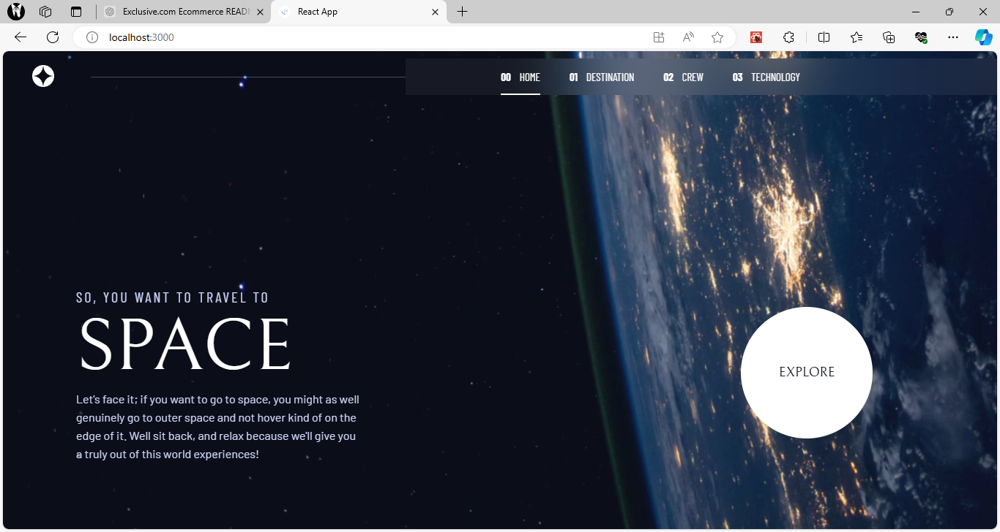

# Frontend Mentor - Space tourism website solution

This is a solution to the [Space tourism website challenge on Frontend Mentor](https://www.frontendmentor.io/challenges/space-tourism-multipage-website-gRWj1URZ3). Frontend Mentor challenges help you improve your coding skills by building realistic projects.

## Table of contents

- [Overview](#overview)
  - [The challenge](#the-challenge)
  - [Screenshot](#screenshot)
  - [Links](#links)
- [My process](#my-process)
  - [Built with](#built-with)
  - [What I learned](#what-i-learned)
  - [Continued development](#continued-development)
  - [Useful resources](#useful-resources)
- [Author](#author)

**Note: Delete this note and update the table of contents based on what sections you keep.**

## Overview

### The challenge

Users should be able to:

- View the optimal layout for each of the website's pages depending on their device's screen size
- See hover states for all interactive elements on the page
- View each page and be able to toggle between the tabs to see new information

### Screenshot



**Note: Delete this note and the paragraphs above when you add your screenshot. If you prefer not to add a screenshot, feel free to remove this entire section.**

### Links

- Solution URL: [Add solution URL here](https://github.com/DOOMSDAY101/space-tourism)
- Live Site URL: [Add live site URL here](https://ifeoluwa-space-toursim.netlify.app)

## My process

### Built with

- Semantic HTML5 markup
- CSS custom properties
- Flexbox
- CSS Grid
- Mobile-first workflow
- [React](https://reactjs.org/) - JS library
- [React-router-dom](https://reactrouter.com) - React framework
- [Typescript](https://typescripttutorial.net)

### What I learned

1. I learned to set up a React project with typescript.
2. I gained familiarity with Typescript basics, including type annotations, interfaces and type aliases.
3. I learned to define and use generics for creating reusable and flexible components.
4. I improved my debugging skills using Typescript's type checking.
5. I understood the benefits of Typescript in ehnhancing code readablity and maintainabilty

```js
const [selectedOptionIndex, setSelectedOptionIndex] = useState < number > 0;

const handleOptionClick = (index: number): void => {
  setSelectedOptionIndex(index);
};
```

### Continued development

1. Deepen my understanding of advanced typescript features like generics, mapped types and utility types.
2. Investigate and implement more complex state management libraries such as Redux, Zustand, etc.
3. Focus on writing comprehensive tests using tools like jest and React Testing library.
4. Expand my knowledge to using Typescipt in a Node.js environment for full-stack Typescript applications.
5. Collaborate on open-source projects to gain experience with larger codebases and community-driven development.

**Note: Delete this note and the content within this section and replace with your own plans for continued development.**

### Useful resources

- [Typescript.net](https://typescripttutorial.net) - This helped me in understanding typescript effectively.

## Author

- Website - [Ifeoluwa Sulaiman (Dev-Ife)](https://dev-ife.netlify.app)
- Frontend Mentor - [@DOOMSDAY101](https://www.frontendmentor.io/profile/DOOMSDAY101)
- Twitter - [@Sulaiman_Ife](https://www.twitter.com/Sulaiman_Ife)
